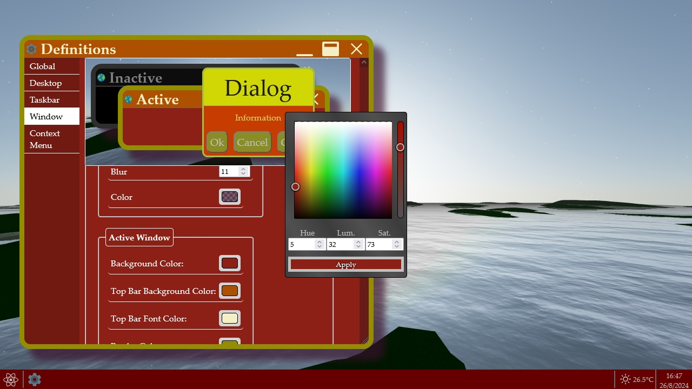
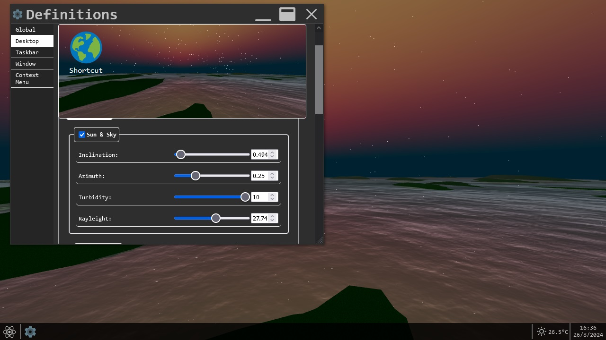

  
A mock operating system on a webpage

[Live Website](https://dgloliveira.github.io/Virtual-Desktop/)

# Summary

This is a Web App based on the style and features present in a typical Operating System. The major focus of this app is to replicate a GUI that embraces high user customization, and is capable of running other apps inside it within a dynamic window, as if a program on your computer or mobile. 

# Featured

### Customization

Within the Settings app, present in the Start Menu on the Taskbar, there is a wide array of styling options for the user to play around, ranging from changing the color, size and style of several application components, all the way to making round corners, dashed borders and blurry window shadows. 

The most notable feature here is the background, while it is possible to keep it a simple plain color or upload an image to your liking, the unique feature is the animated 3D background, and the hability to personalize it, its possible to turn off or on features such as the stars or the water, change the color of the landscape by changing the color of the light, mess with the fog, and generate different skies, such as night or twilight. 

Future plans: 
 -For the animated background, include presets daytime and weather systems, more landscapes, the moon, and eventually the hability of syncronize it with the Weather data from a provided location;
 -More Star button icons and animations
 -Customizable Cursor
 -OS sound effects
 -Other OS styles, such as Apple or Linux Ubuntu

# Widgets

### Weather

As a feature of most personal based operating systems, be it for PC or mobile, is the hability of knowing the local weather, as such, a widget in the corner of the taskbar has been incorporated into the system. With basic features such as determining the user location with GPS, by city name or provided coordinates, this widget leverages the Open-Meteo free API to provide the data necessary, on an hourly basis, all the way to the weekly forecast. The most notable feature here is providing a chart for each individual data point, so that the user can know in finer detail the forecast for specific data, instead of the regular maximum, minimum and current time. Otherwise the widget has the standard functionalities present in most other weather apps, such as providing current relevant data and changing the units from imperial to metric, and a few others.

|
|
|
|

Future features will include: 
 -Incorporation of a warning system for weather and other emergency situations.
 -A more functional map, leveraging Open-Layers API, as it currently only displays where the data is being fetched from; 
 -Fetching more optional datapoints for users with specific necessities, such as dew point or soil humidity; 
 -Introducing more APIs that fetch the moon state and satellite imaging, expanding the weather icon variety;
 -Incorporating it with the Animated 3D background, dynamically changing it in accordance to the data.

### Calendar

Another common feature, present in all operating systems, is the hability to show the current time, date, and a calendar, once again, made in the style of Windows 10. The only notable feature here is that the user can replace how the date is shown in the taskbar, including a simple analog clock.

Future features will include:
 -Customizable Analog clock, and more clock styles;
 -Incorporating an API that fetches relevant data for the day, such as holidays and notable events;

# Apps

### Drawdoc

A stylized but limited version of the well known Paint program, present in most Windows operating systems. This app allows the user to create a .png image with the use of basic tools such as the brush, bucket, erasor and a form and shape generator for lines, curves, polygons, stars, hearts and arrows. The objective here is not to stray away too much from the original program in terms of functionality, with its only unique feature being the hability to generate stretched shapes and stars with dozens of points. 

This app is currently in development, as some of its features are currently not intuitive or practical.

### Arcade

A package of remade famous games, wrapped in a single app, with the hability to change keybinds. Currently includes Snake, Breakout, and Space Invaders. These are not faithfull remakes, and besides Snake, they include some twist or modification that make them slightly different than the original. For Breakout, it currently includes only 3 levels, and has no notable features. For Space Invaders, the graphics have been altered and the obstacles have been replaced with indestructible asteroids, and the game is finite, once all invaders are defeated, its over. 

|
|
|
|

Future plans: 
 -Develop upon current game logic into a more fullfledge versions; 
 -Introduce splash screens, sound effects and soundtracks.
 -Expand the rooster; 

### Calculator

Another basic tool for all operating systems for PC and Mobile, the faithfull calculator. This one includes a scientific and graphic version! 
The only notable mention here is not visible, but rather within the code itself, as the goal here was to reject the commonly used <i>eval()</i> function, due to its dangerous nature, as it leaves the code exposed to script injection attacks, and instead hardcode the calculation process.

|
|
|
|

Future plans:
 -Expand upon graphic mode, in order to track cursor position and calculate intersection points of multiple function.
 -Introduce a plotting mode, where it is possible to draw shapes by means of pure mathematical logic.
 -Introduce a 3D graphic mode, capable of rendering functions with 2 variables.

# Other Plans

As one can deduce from the scope of this project, there is no end to the possibilities, however, a plan with too wide a scope for a single self-taugh developer might as well be a pie in the sky. As such future plans have currently been limited to the already mentioned ones, wich are already large enough, and the creation of a half a dozen other apps and functionalities, mostly simple ones that aim to replicate the most basic prebuilt programs for all operating systems. 

### Global Plans:

Currently, while the buttons are present for the apps within the menu bar, there is neither a help feature or about feature. This will be corrected ASAP.

### Future Features:

 -Desktop Shortcut functionality.
 -Preview window for minimized Apps.
 -Use of local storage, allowing user customizations to persist outside of current session.
 -Enhanced clipboard functionality, expanding user ability to copy and paste across apps to include data other than strings and numbers.
 -File system and File explorer.

### Near Future Apps:

 -Simple text editor, in the style of Notepad.
 -Package of famous boardgames and card games, such as Mahjong and Solitaire.
 -Magnifying tool, essentially an on screen magnifying glass.
 -ASCII character map, faithfull to the MS Character map included in most versions of Windows.
 -On-Screen Keyboard with customizable display, if the user happens to have problems with the keyboard or only very specific keys, or even a damaged touchscreen.

### Far Future Apps:

 -Rich text editor, that is, a simplified version of MS Word, leveraging an already existing node package to be determined.
 -Spreadsheet creator, a simplified version of MS Excell, also leveraging an already existing node package to be determined.
 -Task Manager, always nice to know wich app is consuming what resources, and provide a way to forcefully terminate it without reloading the whole page.
 -Package of simple 3D single player games, either already made games whose licence expired or games made by myself.

